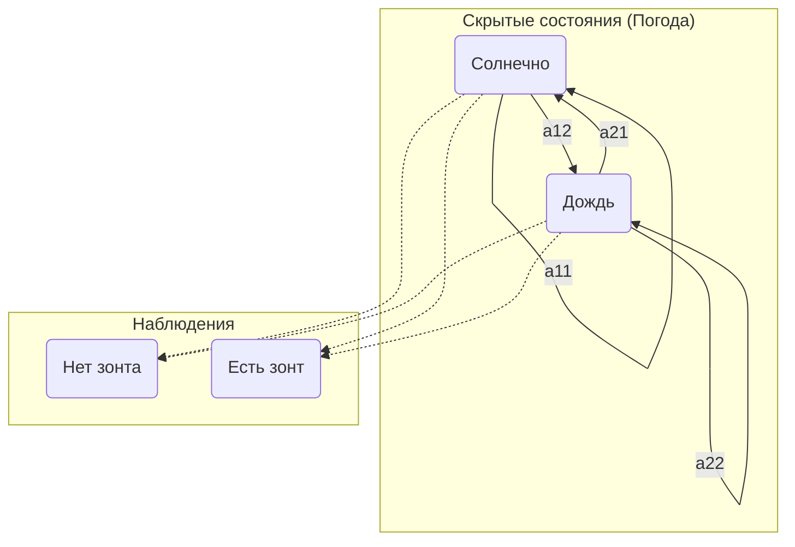

---
aliases:
  - скрытая марковская модель
  - HMM
  - Hidden Markov Model
---
# Скрытая марковская модель

**Скрытая марковская модель (HMM)** — это статистическая модель, которая позволяет описывать системы, являющиеся [[Определения кратко/Теорвер|марковскими процессами]] с неизвестными (скрытыми) состояниями. Мы не можем наблюдать состояния системы напрямую, но можем наблюдать некоторые выходные данные (наблюдения), которые зависят от этих состояний.

## Основная идея

Представьте себе, что вы находитесь в комнате без окон и хотите определить погоду на улице (солнечно, облачно, дождь). Единственная доступная вам информация — это наличие или отсутствие у человека, входящего в комнату, зонтика.

*   **Скрытые состояния**: Погода на улице (`Солнечно`, `Дождь`). Мы не видим её напрямую. Переход от одного состояния к другому (например, от `Солнечно` к `Дождь`) является [[Определения кратко/Теорвер|марковским процессом]].
*   **Наблюдения**: Действия человека (`Есть зонт`, `Нет зонта`). Эти наблюдения зависят от скрытого состояния (погоды).

HMM позволяет, имея последовательность наблюдений (например: `Нет зонта`, `Нет зонта`, `Есть зонт`), сделать выводы о наиболее вероятной последовательности скрытых состояний (погоды).

## Компоненты модели

Формально, HMM $\lambda$ определяется набором из трёх параметров: $\lambda = (A, B, \pi)$.

1.  **Матрица вероятностей перехода состояний $A$**:
    Матрица $A = \{a_{ij}\}$ размера $N \times N$ (где $N$ — число скрытых состояний), в которой элемент $a_{ij}$ — это вероятность перехода из состояния $s_i$ в состояние $s_j$:
    $$
    a_{ij} = P(q_{t+1}=s_j | q_t=s_i)
    $$

2.  **Матрица вероятностей наблюдений (эмиссии) $B$**:
    Матрица $B = \{b_j(k)\}$ размера $N \times M$ (где $M$ — число возможных наблюдений), в которой элемент $b_j(k)$ — это вероятность наблюдения $v_k$ в тот момент, когда система находится в скрытом состоянии $s_j$:
    $$
    b_j(k) = P(o_t=v_k | q_t=s_j)
    $$

3.  **Вектор начальных вероятностей состояний $\pi$**:
    Вектор $\pi$ размера $N$, где элемент $\pi_i$ — это вероятность того, что система в начальный момент времени ($t=1$) находится в состоянии $s_i$:
    $$
    \pi_i = P(q_1=s_i)
    $$

## Три основные задачи для HMM

Существует три канонические задачи, которые решаются с помощью HMM:

1.  **Задача оценки (Evaluation)**:
    *   **Вопрос**: Дана модель $\lambda = (A, B, \pi)$ и последовательность наблюдений $O$. Какова вероятность $P(O|\lambda)$ того, что данная модель породила эту последовательность?
    *   **Решение**: **Алгоритм прямого-обратного хода (Forward-backward algorithm)**.

2.  **Задача декодирования (Decoding)**:
    *   **Вопрос**: Дана модель $\lambda$ и последовательность наблюдений $O$. Какова наиболее вероятная последовательность скрытых состояний $Q = q_1, q_2, \dots, q_T$, которая привела к этим наблюдениям?
    *   **Решение**: **[[Алгоритм Витерби]] ([[Алгоритм Витерби]])**.

3.  **Задача обучения (Learning)**:
    *   **Вопрос**: Дана последовательность наблюдений $O$. Какие параметры модели $\lambda = (A, B, \pi)$ наилучшим образом объясняют эти наблюдения (т.е. максимизируют $P(O|\lambda)$)?
    *   **Решение**: **Алгоритм Баума-Велша**, который является частным случаем [[EM-алгоритм]].

## Применение

Скрытые марковские модели широко используются в различных областях:
*   **Распознавание речи**: Наблюдения — это звуковые сигналы, скрытые состояния — фонемы или слова.
*   **Биоинформатика**: Наблюдения — последовательности ДНК, скрытые состояния — гены или некодирующие участки.
*   **Обработка естественного языка (NLP)**: Наблюдения — слова в предложении, скрытые состояния — части речи (существительное, глагол и т.д.).
*   **Финансовое моделирование**: Наблюдения — цены активов, скрытые состояния — режимы рынка (бычий, медвежий, боковой).