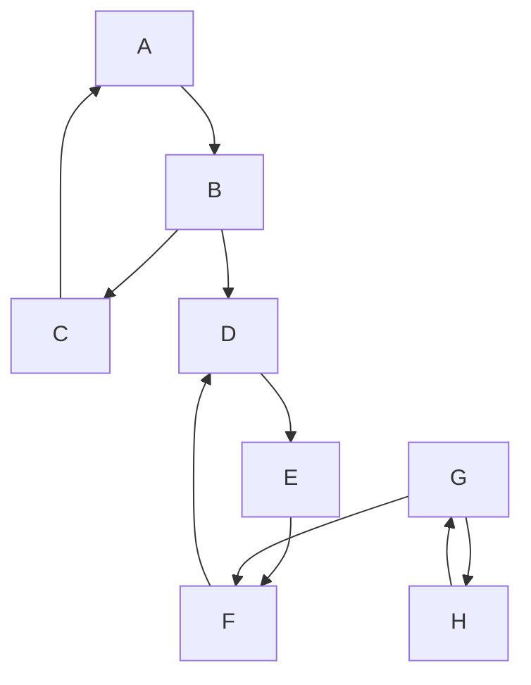

---
aliases:
  - алгоритм Тарьяна
  - Tarjan's strongly connected components algorithm
---
# Алгоритм Тарьяна

**Алгоритм Тарьяна** — это алгоритм поиска [[Сильная компонента связности|сильно связанных компонент]] (SCC) в ориентированном графе, работающий за линейное время. Он основан на [[Поиск в глубину|поиске в глубину (DFS)]].

## Основная идея

Идея алгоритма состоит в том, чтобы выполнять [[Поиск в глубину|поиск в глубину]], начиная с произвольной вершины. Вершины помещаются в стек в порядке их посещения. Когда обход из вершины `v` и всех её потомков завершается, алгоритм проверяет, является ли `v` "корнем" [[Сильная компонента связности|сильно связанной компоненты]].

Вершина `v` является корнем SCC, если ни одна из её достижимых вершин (включая её саму через обратные рёбра) не может достичь вершины с меньшим временем входа (индексом), чем у `v`. Если это условие выполняется, то все вершины, добавленные в стек после `v` (и сама `v`), образуют [[Сильная компонента связности|сильно связанную компоненту]].

## Алгоритм

### Входные данные
*   Ориентированный граф $G = (V, E)$, где $V$ — множество вершин, $E$ — множество рёбер.

### Структуры данных
Для каждой вершины `v` используются две переменные:
*   `index[v]`: время входа (индекс) вершины `v` при [[Поиск в глубину|поиске в глубину]]. Вершины нумеруются с нуля.
*   `lowlink[v]`: наименьший `index` вершины, достижимой из `v` (включая саму `v`), которая всё ещё находится в стеке.

Дополнительно используются:
*   `S`: стек, хранящий посещённые вершины.
*   `onStack[v]`: булевый флаг, показывающий, находится ли вершина `v` в стеке `S`.

### Псевдокод

```
index = 0
S = []
onStack = {}

function strongconnect(v):
    // Устанавливаем время входа и lowlink для вершины v
    index[v] = index
    lowlink[v] = index
    index = index + 1
    S.push(v)
    onStack[v] = true

    // Обходим всех соседей w вершины v
    for each (v, w) in E:
        if index[w] is undefined:
            // Вершина w ещё не посещена, рекурсивно запускаем обход
            strongconnect(w)
            lowlink[v] = min(lowlink[v], lowlink[w])
        else if onStack[w] is true:
            // Вершина w уже в стеке, значит, есть обратное ребро в текущем SCC
            lowlink[v] = min(lowlink[v], index[w])

    // Если v - корень SCC, извлекаем компоненту из стека
    if lowlink[v] == index[v]:
        start a new strongly connected component
        repeat
            w = S.pop()
            onStack[w] = false
            add w to current strongly connected component
        while w != v
        output the current strongly connected component

// Основной цикл
for each v in V:
    if index[v] is undefined:
        strongconnect(v)
```

### Сложность
*   **Время:** $O(|V| + |E|)$, так как алгоритм посещает каждую вершину и каждое ребро ровно один раз.
*   **Память:** $O(|V|)$ для хранения `index`, `lowlink`, `onStack` и стека `S`.

## Пример

Рассмотрим следующий граф:



**Результат работы алгоритма:**

Алгоритм найдёт три [[Сильная компонента связности|сильно связанные компоненты]]:
1.  `{A, B, C}`
2.  `{D, E, F}`
3.  `{G, H}`

Это происходит потому, что внутри каждой из этих групп вершин любая вершина достижима из любой другой.