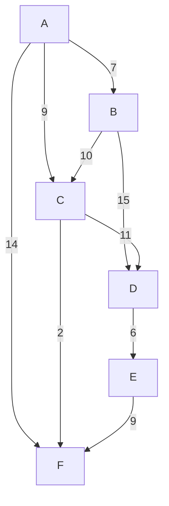

---
aliases:
  - алгоритм Дейкстры
  - Dijkstra's algorithm
---
# Алгоритм Дейкстры

**Алгоритм Дейкстры** — это "жадный" алгоритм для нахождения кратчайших путей от одной (стартовой) вершины до всех остальных вершин во взвешенном [[Граф|графе]] с **неотрицательными** весами рёбер.

## Основная идея

Алгоритм Дейкстры работает пошагово. На каждом шаге он "посещает" ближайшую из ещё не посещённых вершин.

1.  Изначально расстояния до всех вершин, кроме стартовой, считаются бесконечными. Расстояние до стартовой вершины равно 0.
2.  Создаётся множество посещённых вершин (изначально пустое) и очередь с приоритетом, содержащая все вершины графа. Приоритет вершины — это текущее известное расстояние до неё.
3.  Пока в очереди есть непосещённые вершины, алгоритм выполняет следующие действия:
   *   Извлекает из очереди вершину `u` с наименьшим расстоянием.
   *   Добавляет `u` в множество посещённых.
   *   Для каждого соседа `v` вершины `u` выполняется операция **релаксации (relaxation)**: если путь до `v` через `u` короче, чем текущий известный путь до `v`, то расстояние до `v` обновляется.

Этот процесс гарантирует, что когда вершина извлекается из очереди, найденный до неё путь является кратчайшим.

## Алгоритм

### Входные данные
*   [[Граф|Граф]] $G = (V, E)$ с весами рёбер $w(u, v) \geq 0$.
*   Стартовая вершина $s \in V$.

### Структуры данных
*   `dist[v]`: Массив для хранения длины кратчайшего пути от $s$ до $v$. Изначально `dist[s] = 0` и `dist[v] = \infty` для всех $v \neq s$.
*   `prev[v]`: Массив для восстановления кратчайшего пути (хранит предыдущую вершину на пути).
*   `Q`: Очередь с приоритетом, содержащая вершины, которые предстоит посетить. Приоритет определяется значением `dist`.

### Псевдокод

```
function Dijkstra(G, s):
    // Инициализация
    for each vertex v in G.V:
        dist[v] = infinity
        prev[v] = undefined
    dist[s] = 0

    Q = new PriorityQueue(G.V) // Все вершины в очереди

    while Q is not empty:
        u = Q.extract_min() // Извлекаем вершину с наименьшим dist

        for each neighbor v of u:
            // Релаксация ребра (u, v)
            alt = dist[u] + weight(u, v)
            if alt < dist[v]:
                dist[v] = alt
                prev[v] = u
                Q.decrease_key(v, alt) // Обновляем приоритет в очереди
    
    return dist, prev
```

### Сложность

Сложность алгоритма зависит от реализации очереди с приоритетом:

*   **На основе массива**: $O(|V|^2)$. Поиск минимума занимает $O(|V|)$, и это делается $|V|$ раз. Подходит для плотных графов.
*   **На основе двоичной кучи (binary heap)**: $O((|V| + |E|) \log |V|)$. Это наиболее распространённая реализация.
*   **На основе фибоначчиевой кучи (Fibonacci heap)**: $O(|E| + |V| \log |V|)$. Асимптотически самая быстрая, но сложнее в реализации.

**Память:** $O(|V|)$ для хранения массивов `dist` и `prev`.

## Пример

Найдём кратчайшие пути из вершины **A** для следующего графа:



**Результат работы:**

Алгоритм найдёт следующие кратчайшие пути и расстояния от **A**:
*   **A**: 0
*   **B**: 7 (A -> B)
*   **C**: 9 (A -> C)
*   **D**: 20 (A -> C -> D)
*   **F**: 11 (A -> C -> F)
*   **E**: 26 (A -> C -> D -> E)

## Отличие от [[Поиск в ширину|BFS]]

[[Поиск в ширину|BFS]] является частным случаем алгоритма Дейкстры для графов, где все рёбра имеют одинаковый вес (например, 1). В этом случае очередь с приоритетом превращается в обычную очередь.

