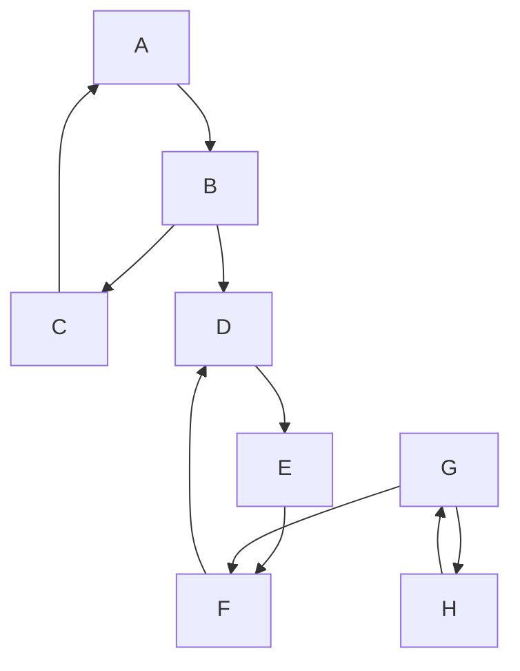

---
aliases:
  - алгоритм Косарайю
  - Kosaraju's algorithm
  - алгоритм Косарайю-Шарира
---
# Алгоритм Косарайю

**Алгоритм Косарайю** (также известный как **алгоритм Косарайю-Шарира**) — это алгоритм для поиска [[Сильная компонента связности|сильно связанных компонент]] ([[Сильная компонента связности|SCC]]) в ориентированном графе. Он основан на двух последовательных проходах [[Поиск в глубину|поиска в глубину (DFS)]].

## Основная идея

Алгоритм использует тот факт, что если "сжать" каждую [[Сильная компонента связности|сильную компоненту связности]] в одну вершину, то полученный [[Граф]] компонент будет ациклическим. Идея состоит в том, чтобы найти "финальную" компоненту (ту, из которой нет рёбер в другие компоненты), извлечь её, а затем повторить процесс для оставшегося графа.

Алгоритм Косарайю элегантно реализует эту идею с помощью двух проходов [[Поиск в глубину|DFS]]:

1.  **Первый проход (на исходном графе $G$)**: Этот [[Поиск в глубину|DFS]] используется для определения порядка обхода вершин во втором проходе. Вершины сортируются в порядке убывания времени их выхода (finishing time). Вершина с наибольшим временем выхода гарантированно принадлежит "начальной" [[Сильная компонента связности|SCC]] в графе $G$ (или "финальной" [[Сильная компонента связности|SCC]] в транспонированном граfe $G^T$).

2.  **Второй проход (на транспонированном графе $G^T$)**: [[Поиск в глубину|DFS]] запускается на инвертированном графе $G^T$. Обход начинается с вершины с наибольшим временем выхода из первого прохода. Все вершины, достижимые из неё в $G^T$, образуют первую [[Сильная компонента связности|сильную компоненту связности]]. Затем алгоритм берёт следующую непосещённую вершину из отсортированного списка и повторяет процесс, находя следующую компоненту, и так далее.

## Алгоритм

### Входные данные
*   Ориентированный [[Граф]] $G = (V, E)$.

### Шаги

1.  **Первый проход ([[Поиск в глубину|DFS]] на $G$)**
    *   Запустить [[Поиск в глубину|DFS]] на графе $G$.
    *   По мере завершения рекурсивного вызова для каждой вершины `u` (т.е. после посещения всех её потомков), добавлять `u` в начало списка `L`. В итоге `L` будет содержать вершины, отсортированные по убыванию времени выхода.

2.  **Транспонирование графа**
    *   Создать [[Граф]] $G^T$, инвертировав все рёбра графа $G$. Если в $G$ было ребро $(u, v)$, то в $G^T$ будет ребро $(v, u)$.

3.  **Второй проход ([[Поиск в глубину|DFS]] на $G^T$)**
    *   Сбросить флаги посещения для всех вершин.
    *   Для каждой вершины `u` из списка `L` (в порядке их следования):
        *   Если `u` ещё не посещена:
            *   Начать новый [[Поиск в глубину|DFS]] из `u` на графе $G^T$.
            *   Все вершины, посещённые в ходе этого [[Поиск в глубину|DFS]], образуют одну [[Сильная компонента связности|сильную компоненту связности]].
            *   Сохранить найденную компоненту.

### Псевдокод

```
function Kosaraju(G):
    // Шаг 1: Заполнить список L в порядке убывания времени выхода
    L = []
    visited = new set()
    for each vertex u in G.vertices:
        if u not in visited:
            Visit(u, G, visited, L)

    // Шаг 2: Создать транспонированный граф G_T
    G_T = G.transpose()

    // Шаг 3: Найти компоненты на G_T
    components = []
    visited.clear()
    while L is not empty:
        u = L.pop_front() // Берем вершину с наибольшим временем выхода
        if u not in visited:
            component = []
            Assign(u, G_T, visited, component)
            components.push(component)
    
    return components

function Visit(u, G, visited, L):
    visited.add(u)
    for each neighbor v of u in G:
        if v not in visited:
            Visit(v, G, visited, L)
    L.prepend(u) // Добавляем в начало списка после обхода всех потомков

function Assign(u, G_T, visited, component):
    visited.add(u)
    component.push(u)
    for each neighbor v of u in G_T:
        if v not in visited:
            Assign(v, G_T, visited, component)
```

### Сложность
*   **Время:** $O(|V| + |E|)$. Алгоритм состоит из трёх частей: первый [[Поиск в глубину|DFS]] ($O(|V|+|E|)$), транспонирование графа ($O(|V|+|E|)$) и второй [[Поиск в глубину|DFS]] ($O(|V|+|E|)$).
*   **Память:** $O(|V| + |E|)$ для хранения графа, его транспонированной версии, списка `L` и флагов посещения.

## Пример

Рассмотрим тот же [[Граф]], что и для [[Алгоритм Тарьяна|алгоритма Тарьяна]]:



**Результат работы алгоритма:**

Алгоритм Косарайю также найдёт три [[Сильная компонента связности|сильно связанные компоненты]]:
1.  `{A, B, C}`
2.  `{D, E, F}`
3.  `{G, H}`

## Сравнение с [[Алгоритм Тарьяна|алгоритмом Тарьяна]]
*   **Концептуальная сложность**: Алгоритм Косарайю часто считается более простым для понимания, так как он чётко разделен на три этапа.
*   **Производительность**: На практике [[Алгоритм Тарьяна|алгоритм Тарьяна]] обычно немного быстрее, так как требует только одного прохода [[Поиск в глубину|DFS]] и не нуждается в явном построении транспонированного графа.