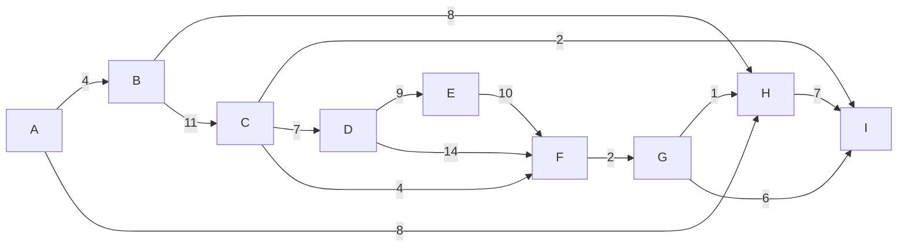

---
aliases:
  - алгоритм Краскала
  - Kruskal's algorithm
---
# Алгоритм Краскала

**Алгоритм Краскала** — это "жадный" алгоритм для нахождения **минимального остовного дерева (MST)** во взвешенном связном неориентированном [[Граф|графе]]. Как и [[Алгоритм Прима|алгоритм Прима]], он строит подграф, соединяющий все вершины с минимальной суммой весов рёбер без циклов.

## Основная идея

В отличие от [[Алгоритм Прима|алгоритма Прима]], который "выращивает" одно дерево из начальной вершины, алгоритм Краскала работает иначе. Он рассматривает все вершины как отдельный "лес" из $|V|$ деревьев (каждое из одной вершины). Затем он последовательно объединяет эти деревья, добавляя самые "дешёвые" рёбра, которые не образуют циклов.

1.  Все рёбра [[Граф|графа]] сортируются по весу в неубывающем порядке.
2.  Алгоритм перебирает отсортированные рёбра.
3.  Для каждого ребра `(u, v)` проверяется, принадлежат ли вершины `u` и `v` разным деревьям (компонентам).
    *   Если да, то это ребро добавляется в минимальное остовное дерево, а деревья, содержащие `u` и `v`, объединяются в одно.
    *   Если нет (вершины уже в одном дереве), то добавление этого ребра создаст цикл, поэтому оно игнорируется.
4.  Процесс завершается, когда в остовное дерево будет добавлено $|V|-1$ ребро.

## Алгоритм

### Входные данные
*   Связный, неориентированный, взвешенный [[Граф|граф]] $G = (V, E)$.

### Структуры данных
*   **Список всех рёбер**, отсортированный по весу.
*   **Система непересекающихся множеств (Disjoint Set Union, DSU)**: Эта структура данных идеально подходит для отслеживания компонент связности. Она позволяет очень быстро выполнять две операции:
    *   `find(v)`: определить, к какому множеству (дереву) принадлежит вершина `v`.
    *   `union(u, v)`: объединить множества, содержащие `u` и `v`.

### Псевдокод

```
function Kruskal(G):
    MST = [] // Результат - рёбра минимального остовного дерева

    // 1. Отсортировать все рёбра по весу
    edges = G.edges.sort_by_weight()

    // 2. Инициализировать DSU: каждая вершина в своём множестве
    dsu = new DSU(G.vertices)

    // 3. Перебрать рёбра в порядке возрастания веса
    for each edge (u, v) with weight w in edges:
        // Если u и v в разных компонентах (не образуют цикл)
        if dsu.find(u) != dsu.find(v):
            // Добавить ребро в MST и объединить компоненты
            MST.add((u, v))
            dsu.union(u, v)

    return MST
```

### Сложность
*   **Время:** $O(|E| \log |E|)$ или $O(|E| \log |V|)$.
    *   Сортировка рёбер занимает $O(|E| \log |E|)$.
    *   Последующий перебор рёбер с использованием DSU (с оптимизациями "объединение по рангу/размеру" и "сжатие пути") занимает почти линейное время, близкое к $O(|E|)$.
    *   Таким образом, общая сложность определяется этапом сортировки.
*   **Память:** $O(|V| + |E|)$ для хранения графа, списка рёбер и структуры DSU.

## Пример

Найдём минимальное остовное дерево для того же графа, что и в примере для [[Алгоритм Прима|алгоритма Прима]]:

(представим, что он неориентированный)


**Результат работы:**

1.  Сортируем рёбра: `(G,H,1), (C,I,2), (F,G,2), (A,B,4), (C,F,4), (G,I,6), (C,D,7), (H,I,7), ...`
2.  Берём **(G, H)**, вес 1. Объединяем {G} и {H}.
3.  Берём **(C, I)**, вес 2. Объединяем {C} и {I}.
4.  Берём **(F, G)**, вес 2. Объединяем {F} и {G, H}. Теперь у нас компонента {F, G, H}.
5.  Берём **(A, B)**, вес 4. Объединяем {A} и {B}.
6.  Берём **(C, F)**, вес 4. Объединяем {C, I} и {F, G, H}. Теперь компонента {C, F, G, H, I}.
7.  Берём (G, I), вес 6. `find(G) == find(I)`, так как они уже в одной компоненте. Пропускаем.
8.  Берём **(C, D)**, вес 7. Объединяем {D} и {C, F, G, H, I}.
9.  Берём (H, I), вес 7. `find(H) == find(I)`. Пропускаем.
10. Берём **(A, H)**, вес 8. Объединяем {A, B} и {C, D, F, G, H, I}.
11. Берём (B, H), вес 8. `find(B) == find(H)`. Пропускаем.
12. Берём **(D, E)**, вес 9. Объединяем {E} с остальными.

Все вершины соединены. Итоговое дерево состоит из рёбер: `(G,H), (C,I), (F,G), (A,B), (C,F), (C,D), (A,H), (D,E)`. Суммарный вес 37.
## Сравнение с [[Алгоритм Прима|алгоритмом Прима]]

*   **Подход**: Краскал строит "лес" и объединяет деревья. Прим "выращивает" одно дерево.
*   **Данные**: Краскал работает со списком рёбер. Прим работает с вершинами и их соседями.
*   **Применимость**: Краскал обычно эффективнее для **разреженных** графов (где $|E|$ близко к $|V|$), так как его сложность зависит от $|E| \log |E|$. [[Алгоритм Прима|Прим]] (с двоичной кучей) может быть быстрее для **плотных** графов, где $|E|$ близко к $|V|^2$.