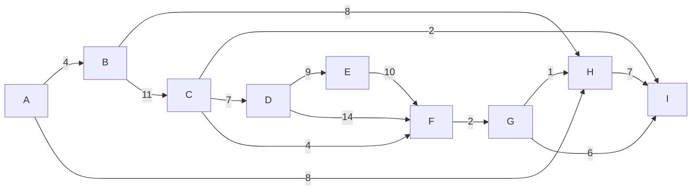

---
aliases:
  - алгоритм Прима
  - Prim's algorithm
---
**Алгоритм Прима** — это "жадный" алгоритм, используемый для нахождения **минимального остовного дерева (MST)** во взвешенном связном неориентированном [[Граф|графе]]. Минимальное остовное дерево — это подграф, который соединяет все вершины вместе с минимально возможной суммой весов рёбер и не содержит циклов.

## Основная идея

Алгоритм строит минимальное остовное дерево, последовательно добавляя в него вершины. Он работает следующим образом:

1.  Начинает с произвольной вершины, которая образует начальное дерево.
2.  На каждом шаге ищется ребро с наименьшим весом, которое соединяет вершину из уже построенного дерева с вершиной, ещё не включённой в дерево.
3.  Это ребро и соответствующая ему вершина добавляются в дерево.
4.  Процесс повторяется до тех пор, пока все вершины [[Граф|графа]] не будут включены в дерево.

Поскольку на каждом шаге выбирается самое "дешёвое" ребро для расширения дерева, алгоритм относится к классу жадных.

## Алгоритм

### Входные данные
*   Связный, неориентированный, взвешенный [[Граф|граф]] $G = (V, E)$.

### Структуры данных
Для эффективной реализации обычно используются:
*   `key[v]`: Массив для хранения минимального веса ребра, соединяющего вершину `v` с деревом.
*   `parent[v]`: Массив для хранения родительской вершины для `v` в построенном дереве.
*   `Q`: Очередь с приоритетом, содержащая вершины, ещё не включённые в дерево. Приоритет определяется значением `key`.

### Псевдокод

```
function Prim(G, w, r): // G - граф, w - веса, r - стартовая вершина
    // Инициализация
    for each vertex u in G.V:
        key[u] = infinity
        parent[u] = NIL
    key[r] = 0

    Q = new PriorityQueue(G.V) // Все вершины в очереди с приоритетом key

    while Q is not empty:
        u = Q.extract_min() // Извлекаем вершину с наименьшим key

        for each neighbor v of u:
            // Если v ещё не в дереве и ребро (u,v) "дешевле" текущего пути к v
            if v is in Q and w(u, v) < key[v]:
                parent[v] = u
                key[v] = w(u, v)
                Q.decrease_key(v, key[v]) // Обновляем приоритет v в очереди

    // Результат - множество рёбер (v, parent[v]) для всех v, кроме r
    return parent
```

### Сложность

Сложность алгоритма, как и у [[Алгоритм Дейкстры|алгоритма Дейкстры]], зависит от реализации очереди с приоритетом:

*   **На основе массива**: $O(|V|^2)$. Подходит для плотных графов.
*   **На основе двоичной кучи (binary heap)**: $O(|E| \log |V|)$. Стандартная реализация.
*   **На основе фибоначчиевой кучи (Fibonacci heap)**: $O(|E| + |V| \log |V|)$.

**Память:** $O(|V| + |E|)$.

## Пример

Найдём минимальное остовное дерево для следующего графа, начав с вершины **A**:
(представим, что он неориентированный)


**Результат работы:**

Алгоритм построит следующее дерево с суммарным весом 37:
1.  Начинаем с **A**.
2.  Добавляем ребро **(A, B)** с весом 4.
3.  Добавляем ребро **(A, H)** с весом 8. Нет, из {A,B} самое дешевое ребро - (A,H) весом 8 или (B,H) весом 8. Выберем (A,H).
4.  Из {A,B,H} самое дешевое ребро - **(H, G)** с весом 1.
5.  Из {A,B,H,G} самое дешевое ребро - **(G, F)** с весом 2.
6.  Из {A,B,H,G,F} самое дешевое ребро - **(F, C)** с весом 4.
7.  Из {A,B,H,G,F,C} самое дешевое ребро - **(C, I)** с весом 2.
8.  Из {A,B,H,G,F,C,I} самое дешевое ребро - **(C, D)** с весом 7.
9.  Из {A,B,H,G,F,C,I,D} самое дешевое ребро - **(D, E)** с весом 9.

Итоговое дерево будет состоять из рёбер: `(A,B), (H,G), (G,F), (F,C), (C,I), (C,D), (D,E), (A,H)`.

## Сравнение с алгоритмом Краскала

*   **Алгоритм Прима** "выращивает" одно дерево из начальной вершины.
*   **[[Алгоритм Краскала]]** строит "лес" из деревьев, постепенно объединяя их.
*   Прим лучше подходит для **плотных** графов, а Краскал — для **разреженных**.

