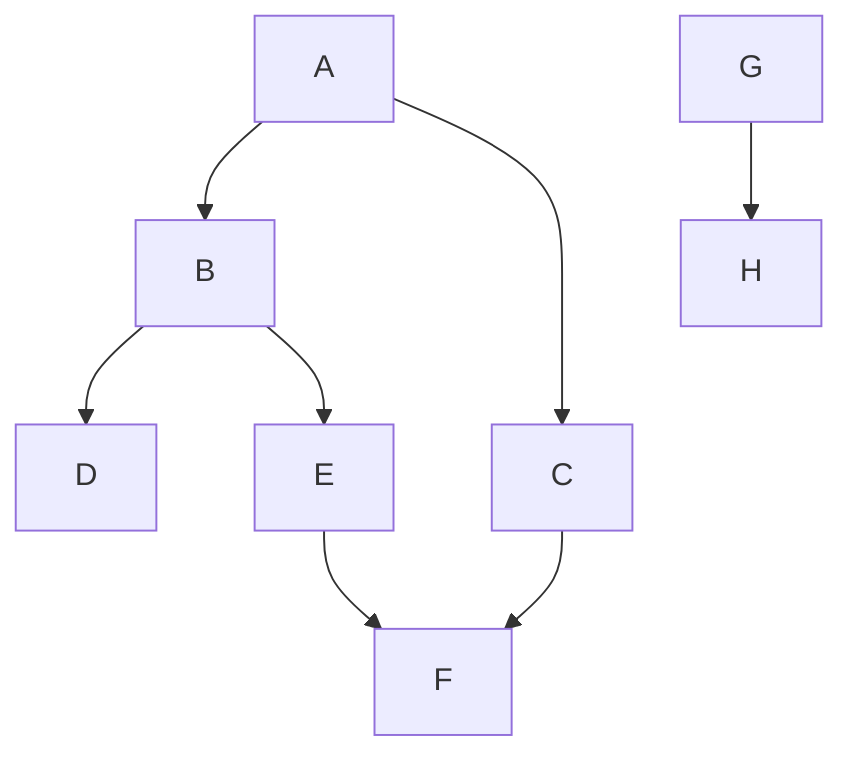

---
aliases:
  - Поиск в глубину
  - DFS
  - Depth-First Search
---
# Поиск в глубину

**Поиск в глубину** (Depth-First Search, DFS) — это один из основных методов обхода [[Граф|графа]]. Алгоритм систематически исследует рёбра графа, "уходя как можно глубже" по каждому пути перед тем, как вернуться назад (backtracking).

## Основная идея

Принцип работы DFS напоминает прохождение лабиринта: мы идем по одному пути до тех пор, пока не упрёмся в тупик. После этого мы возвращаемся на один шаг назад и пробуем пойти по другому, ещё не исследованному пути.

Для отслеживания вершин используется три "цвета":
*   **Белый**: вершина ещё не посещена.
*   **Серый**: вершина посещена, но обход её соседей ещё не завершён (вершина находится в стеке рекурсии).
*   **Чёрный**: вершина и все её потомки в дереве обхода полностью исследованы.

Алгоритм начинается с произвольной "белой" вершины, окрашивает её в "серый" цвет, а затем рекурсивно запускается для всех "белых" соседей этой вершины. После того как все достижимые из данной вершины пути исследованы, она окрашивается в "чёрный" цвет, и происходит возврат из рекурсии.

## Алгоритм

### Входные данные
*   [[Граф]] $G = (V, E)$.

### Структуры данных
*   `visited`: массив или хэш-таблица для отслеживания посещённых вершин (хранения их "цвета").

### Псевдокод (рекурсивная версия)

```
procedure DFS(G, u):
    mark u as visited (серый цвет)
    // Здесь можно выполнить какое-то действие с вершиной u

    for each neighbor v of u in G.AdjacencyList[u]:
        if v is not visited (белый цвет):
            DFS(G, v)
    
    mark u as finished (чёрный цвет)

// Основной цикл для обхода всех компонент связности
for each vertex u in G.Vertices:
    if u is not visited (белый цвет):
        DFS(G, u)
```

### Сложность
*   **Время:** $O(|V| + |E|)$, где $|V|$ — количество вершин, а $|E|$ — количество рёбер. Каждая вершина и каждое ребро посещаются ровно один раз.
*   **Память:** $O(|V|)$ для хранения `visited` и стека рекурсивных вызовов. В худшем случае (для графа-цепочки) глубина рекурсии может достигать $|V|$.

## Пример

Рассмотрим следующий [[Граф]] и начнём обход из вершины **A**.



Один из возможных порядков обхода вершин будет таким:

1.  Начинаем с **A**. Посещаем **A**.
2.  Из **A** идём в **B**. Посещаем **B**.
3.  Из **B** идём в **D**. Посещаем **D**. У **D** нет непосещённых соседей, возвращаемся в **B**.
4.  Из **B** идём в **E**. Посещаем **E**.
5.  Из **E** идём в **F**. Посещаем **F**. У **F** нет непосещённых соседей, возвращаемся в **E**.
6.  У **E** больше нет непосещённых соседей, возвращаемся в **B**.
7.  У **B** больше нет непосещённых соседей, возвращаемся в **A**.
8.  Из **A** идём в **C**. Посещаем **C**. Сосед **F** уже посещён. Возвращаемся в **A**.
9.  У **A** больше нет непосещённых соседей. Обход из **A** завершён.
10. Основной цикл находит непосещённую вершину **G**. Начинаем обход из неё. Посещаем **G**.
11. Из **G** идём в **H**. Посещаем **H**.

Итоговый порядок посещения: **A, B, D, E, F, C, G, H**.

## Применение

Поиск в глубину лежит в основе многих других алгоритмов, таких как:
*   Поиск [[Сильная компонента связности|сильно связанных компонент]] ([[Алгоритм Тарьяна]], [[Алгоритм Косарайю]]).
*   Топологическая сортировка для ациклических графов.
*   Поиск циклов в графе.
*   Решение головоломок и задач (например, поиск выхода из лабиринта).