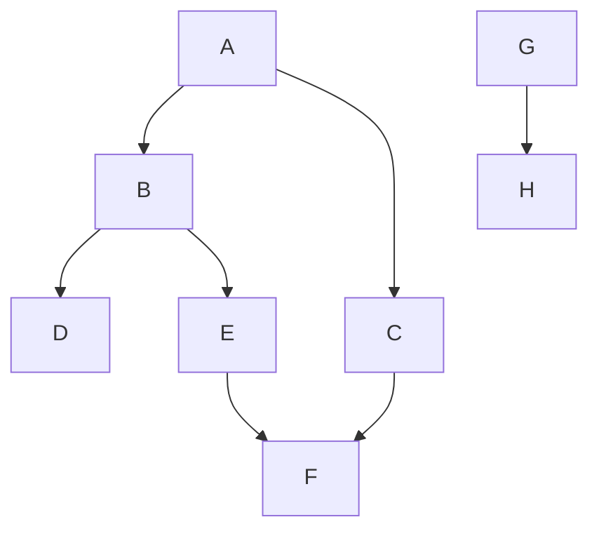

---
aliases:
  - Поиск в ширину
  - BFS
  - Breadth-First Search
---
# Поиск в ширину

**Поиск в ширину** (Breadth-First Search, BFS) — это один из основных методов обхода [[Граф|графа]]. Алгоритм систематически исследует вершины графа, двигаясь "слой за слоем" от начальной вершины.

## Основная идея

Принцип работы BFS заключается в том, чтобы сначала посетить все вершины, находящиеся на расстоянии 1 от начальной (её соседей), затем все вершины на расстоянии 2, и так далее. В отличие от [[Поиск в глубину|поиска в глубину]], который уходит вглубь по одному пути, BFS исследует [[Граф]] равномерно во все стороны.

Для реализации этого порядка обхода используется **очередь (Queue)**.

Алгоритм работает следующим образом:
1.  В очередь помещается начальная вершина и помечается как посещённая.
2.  Пока очередь не пуста, из неё извлекается вершина `u`.
3.  Для каждого непосещённого соседа `v` вершины `u`:
    *   `v` помечается как посещённая.
    *   `v` добавляется в конец очереди.

## Алгоритм

### Входные данные
*   [[Граф]] $G = (V, E)$.
*   Начальная вершина `s`.

### Структуры данных
*   `Q`: очередь для хранения вершин, которые нужно посетить.
*   `visited`: массив или хэш-таблица для отслеживания посещённых вершин.

### Псевдокод

```
procedure BFS(G, s):
    Q = new Queue()
    visited = new set()

    Q.enqueue(s)
    visited.add(s)

    while Q is not empty:
        u = Q.dequeue()
        // Здесь можно выполнить какое-то действие с вершиной u

        for each neighbor v of u in G.AdjacencyList[u]:
            if v is not in visited:
                visited.add(v)
                Q.enqueue(v)

// Для обхода всего графа (включая несвязные компоненты)
for each vertex s in G.Vertices:
    if s is not in visited:
        BFS(G, s)
```

### Сложность
*   **Время:** $O(|V| + |E|)$, где $|V|$ — количество вершин, а $|E|$ — количество рёбер. Каждая вершина и каждое ребро посещаются ровно один раз.
*   **Память:** $O(|V|)$ в худшем случае, когда все вершины могут оказаться в очереди одновременно (например, для графа-звезды).

## Пример

Рассмотрим тот же [[Граф]], что и в примере для [[Поиск в глубину|поиска в глубину]], и начнём обход из вершины **A**.



Порядок обхода вершин будет следующим:

1.  Начинаем с **A**. Добавляем **A** в очередь. Очередь: `[A]`.
2.  Извлекаем **A**. Посещаем её соседей **B** и **C**. Добавляем их в очередь. Очередь: `[B, C]`.
3.  Извлекаем **B**. Посещаем её соседей **D** и **E**. Добавляем их в очередь. Очередь: `[C, D, E]`.
4.  Извлекаем **C**. Посещаем её соседа **F**. Добавляем его в очередь. Очередь: `[D, E, F]`.
5.  Извлекаем **D**. У него нет непосещённых соседей. Очередь: `[E, F]`.
6.  Извлекаем **E**. Его сосед **F** уже посещён. Очередь: `[F]`.
7.  Извлекаем **F**. У него нет непосещённых соседей. Очередь: `[]`.
8.  Очередь пуста. Обход из **A** завершён.
9.  Основной цикл находит непосещённую вершину **G**. Начинаем обход из неё. Добавляем **G** в очередь. Очередь: `[G]`.
10. Извлекаем **G**. Посещаем соседа **H**. Добавляем его в очередь. Очередь: `[H]`.
11. Извлекаем **H**. Соседей нет. Очередь: `[]`.

Итоговый порядок посещения: **A, B, C, D, E, F, G, H**.

## Применение

Поиск в ширину является ключевым для решения следующих задач:
*   **Поиск кратчайшего пути** в невзвешенном графе. Расстояние от начальной вершины до любой другой равно номеру "слоя", на котором эта вершина была найдена.
*   Поиск компонент связности в неориентированном графе.
*   Проверка графа на двудольность.
*   Алгоритм Эдмондса — Карпа для поиска максимального потока.