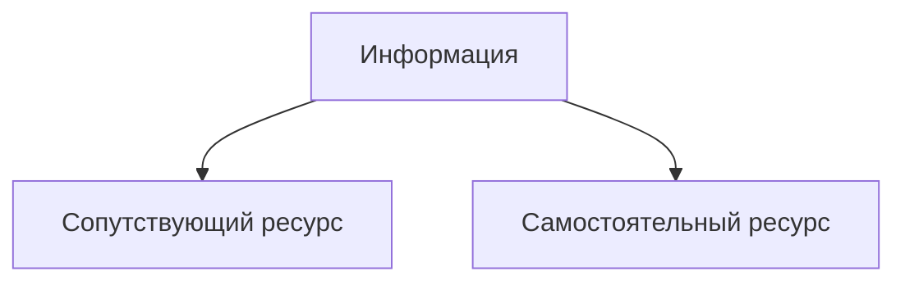
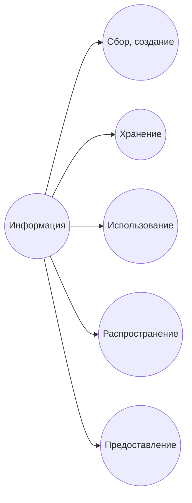
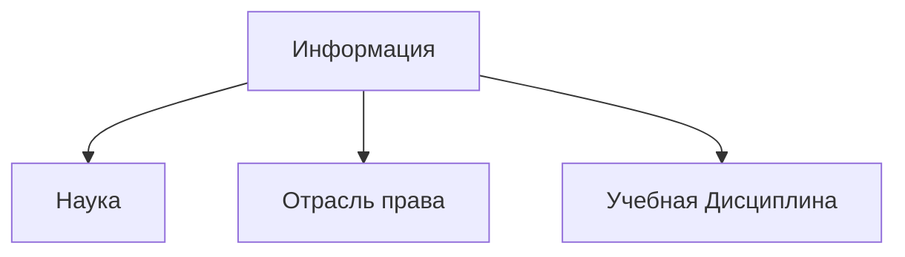

  
  

>1) информация - сведения (сообщения, данные) независимо от формы их представления;    *Из закона об информации*

  
  
  
  

На многие вопросы нет ответов.

  

Это невозможно и быть не может, а это может.

  

Издательтвам верить нельзя.

  

Есть такой вопрос на экзамене

>"Роль информации в жизни общества и государства"

  

Нормы  права регулируют отношения между людьми. Эти нормы приводят отношения между людьми к государственно выгодному виду.

  

## Юридические свойства информации

  

1) Нематериальность

> Что написано пером, то не вырубишь топором

2) Неисчерпаемость

> Неисчерпаемость хорошей информации - это хорошо. Этой неисчерпаемости помог интернет.

3) Нелинейность

4) Организационная форма

5) Обособляемость

> [Информация](https://www.google.com/search?sca_esv=7e7ead78d89c5fa2&sxsrf=AE3TifP8iuhb8ekU5yJhunbT2wpvuj9DvQ:1756707584957&udm=2&fbs=AIIjpHyAGHsd8z6OnJZ_TFOj47YviylcHmKFsax_psUFPQLB9rIIhzqZEHUNtCzvc6r1B9W15oMguy7NQjXoNiIkifAMlPVp5f29i5L0f7tZUmfdio0AGDPLQAdX7spfC2xEidR2SYCp-NKWkp9Bo8GNRMPrJP68ipb6EPEbMpoC5hHM51HfB7rjXDdK0qE1DAxVYt80LVKyeNMgJQgrrOD8XOVOcgqJYyF8ht4Py6p4Q37hEwJq-HPZv_nq_A1AIh9ngGomTHTZFQOWjPrnNTWc5CTGS3CYjQ&q=%D0%BA%D0%B0%D1%80%D1%82%D0%B8%D0%BD%D1%8B+%D0%B0%D0%B4%D0%BE%D0%BB%D1%8C%D1%84%D0%B0+%D0%B3%D0%B8%D1%82%D0%BB%D0%B5%D1%80%D0%B0&sa=X&ved=2ahUKEwj0mM3c9baPAxVT2SoKHUKjAEkQtKgLegQIDhAB&biw=1706&bih=898&dpr=1.5) может отделиться от своего источника

  

> Насколько реально будет установить, кто придумал какой-то рецепт?

6) Тиражируемость

> Вы храните ***интересную книгу одного австрийского автора*** под досками пола, не так ли?  
> © Кидысюк А.В.

  

7) Физическая неотчуждаемость

> Физическая неотчуждаемость информации — это юридическое свойство, которое заключается в том, что знания не отчуждаемы от человека-носителя. Это означает, что при передаче информации ее первоначальный обладатель не теряет доступа к ней, в отличие от материальных объектов.  
*От Qwen-3, сходится с объяснением преподавателя*

8) Субъективность

> Вот ты другу сказал *"Ну ты придурок!"* - это уже будет означать что-то другое, когда вы скажете это мне *[преподавателю]*

  

А дальше думайте интернетом

  

## Основные информационные процессы

  

  

## Авторское определение

  

> Информационное общество - общество, в котором реализуются функции информирования и другие формы применения инфокоммуникационных технологий в процессе обеспечения всех потребителей этого социального ресурса в целях создания условий для реализации их прав и интересов в соответсвтии с базовым принципом - "Информация для всех" при учете условий информационной безопасности общества, государства и человека.
>
> *© Бачило Иллария Лавреньтевна*

  
  

> Информационное общество - общество, в котором информация и уровень ее применения и доступности кардинальным образом влияют на экономические и социокультурные условия жизни граждан.
>
> *Указ Президента РФ от 09.05.17 N203 "О Стратегии развития информационного общества в Российской Федерации на 2017 - 2030 годы"*

  

## Признаки Информационного общества

  

1. нарастающая информатизация;

2. увеличение роли информации, знаний и информационных технологий в жизни общества

3. возрастание числа людей, занятых информациоными технологиями, коммуникациями и производством информационной продукции;

4. создание глобального информационного пространства

5. развитие информационного государства (*электронного правительства*);

6. цифровая трансформация общественных отношений(*национальная цель*);

  

> Окинавская хартия глобального информационного общества - важный документ.

  

## Информационное право

  

  

Информационное право как отрасль права.

  

Все отрасли права различаются между собой:

1. **Предметом** правового регулирования

2. **Методом** правового регулирования