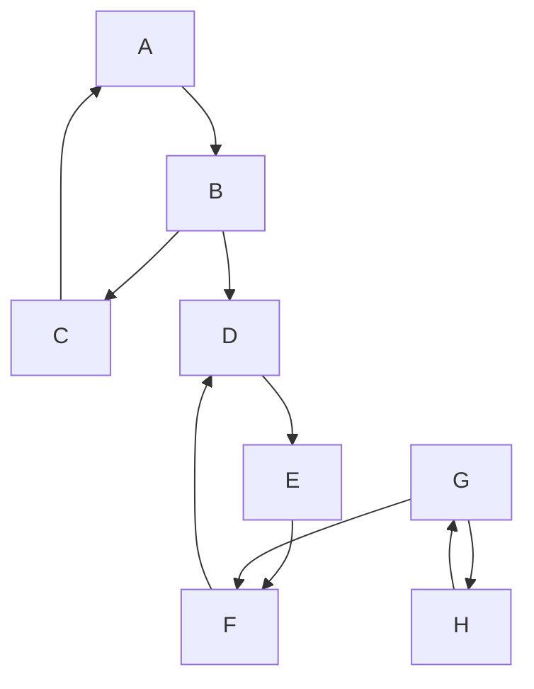
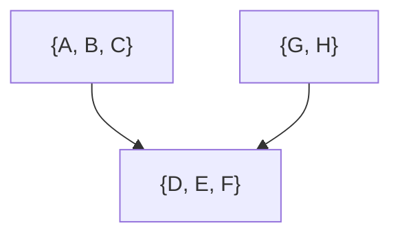

---
aliases:
  - сильно связанная компонента
  - SCC
  - strongly connected component
---
# Сильная компонента связности

**Сильная компонента связности** (или **сильно связанная компонента**, SCC) ориентированного графа $G = (V, E)$ — это максимальное подмножество вершин $C \subseteq V$ такое, что для любых двух вершин $u, v \in C$ существует путь из $u$ в $v$ и путь из $v$ в $u$.

## Основные свойства

1.  **Взаимная достижимость**: Внутри одной компоненты любая вершина достижима из любой другой.
2.  **Максимальность**: Невозможно добавить в компоненту ни одну другую вершину из графа, не нарушив свойство взаимной достижимости.
3.  **Разбиение**: Множество всех сильных компонент связности образует разбиение множества вершин $V$ графа. Это означает, что каждая вершина графа принадлежит ровно одной сильной компоненте связности. Компонента может состоять и из одной вершины.

## Пример

Рассмотрим [[Граф]], который использовался в [[Алгоритм Тарьяна|алгоритме Тарьяна]]:

В этом графе можно выделить три сильные компоненты связности:
*   **{A, B, C}**: Из A можно попасть в B и C, и вернуться обратно. Аналогично для B и C.
*   **{D, E, F}**: Из D можно попасть в E и F, и вернуться обратно. Аналогично для E и F.
*   **{G, H}**: G и H взаимно достижимы.

## Граф компонент (Конденсация)

Если каждую сильную компоненту связности "сжать" в одну вершину, а рёбра провести между этими новыми вершинами, если существовало хотя бы одно ребро между вершинами из соответствующих исходных компонент, то получится новый [[Граф]]. Этот [[Граф]] называется **графом компонент** или **конденсацией** графа.

Важнейшее свойство графа компонент — он всегда является **ациклическим ориентированным графом (DAG)**.

Для приведённого выше примера [[Граф]] компонент будет выглядеть так:

Здесь ребро из `{A, B, C}` в `{D, E, F}` существует из-за ребра `B --> D` в исходном графе. Ребро из `{G, H}` в `{D, E, F}` — из-за ребра `G --> F`.

## Алгоритмы поиска

Для нахождения сильных компонент связности существуют эффективные алгоритмы, работающие за линейное время $O(|V| + |E|)$:
*   [[Алгоритм Тарьяна]]
*   [[Алгоритм Косарайю]]